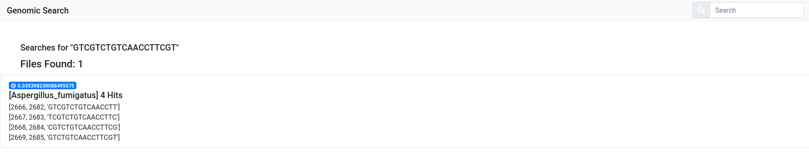

# bloom_genomic_index



This project aims to study the indexing of genomic sequences by using bloom filters, in which is possible to index and search also VCF files (we need to associate the reference) and FASTA files! Details are given bellow.

Supported files: fa.gz, vcf.gz 

# Getting Started

## Setting up 

* Clone the project

* Create a virtual entironment and install dependencies (python3 is necessary):

```
cd server/
virtualenv env
source env/bin/activate
pip3 install -r requirements.txt 

```

* Setup the index:

```
python command_line.py --set_up

```

## Dataset


* Human Genome (reference): ftp://ftp.1000genomes.ebi.ac.uk//vol1/ftp/technical/reference/phase2_reference_assembly_sequence/hs37d5.fa.gz

* VCF for Chromossome 1 for more than 2K samples (corresponding tbi file is needed): 
```
ftp://ftp.1000genomes.ebi.ac.uk/vol1/ftp/release/20130502/ALL.chr1.phase3_shapeit2_mvncall_integrated_v5a.20130502.genotypes.vcf.gz

ftp://ftp.1000genomes.ebi.ac.uk/vol1/ftp/release/20130502/ALL.chr1.phase3_shapeit2_mvncall_integrated_v5a.20130502.genotypes.vcf.gz.tbi 
```

* Other possible downloads for testing:
```
ftp://ftp.ensemblgenomes.org/pub/release-45/plants/fasta/glycine_max/dna/Glycine_max.Glycine_max_v2.1.dna.toplevel.fa.gz

ftp://ftp.ensemblgenomes.org/pub/release-45/bacteria//fasta/bacteria_176_collection/_bacillus_aminovorans/dna/_bacillus_aminovorans.ASM164324v1.dna_sm.toplevel.fa.gz
```

## Index files

* Index and add a reference file:

```
python command_line.py --index_reference <some_ref_id> <path to fa.gz file> 

```

* Index a vcf file (file *.vcf.gz.tbi must exists on same location):

```
python3 command_line.py --index_file <ref_ref_id already on index> <path to vcf.gz>

```

After the index process completes a file is saved with the raw sequence indexed with the name _indexed_<file id>.txt


* Run stats to check if everything is as expected:

```

python command_line.py --stats

```

* Execute a search:

```

python command_line.py --search <str_to_search>

```


## Run index with the web interface

* Run everything:

```
docker-compose up

```

* Access the web interface at http://localhost:8000


# Notes

Understanding VCF file format:
https://gatkforums.broadinstitute.org/gatk/discussion/1268/what-is-a-vcf-and-how-should-i-interpret-it

Human genome data repository:
```
ftp://ftp.1000genomes.ebi.ac.uk/vol1/ftp/release/20130502/
```

A subset can be created with:
```sh
tabix -h ftp://ftp.1000genomes.ebi.ac.uk/vol1/ftp/release/20130502/ALL.chr1.phase3_shapeit2_mvncall_integrated_v5a.20130502.genotypes.vcf.gz 1:1-1000000 | vcf-subset  -c HG03279,HG02353,HG00560,HG00657,HG02652,HG02275,HG01432,HG02819,NA19657,HG01676 > out.vcf
```

The url for the ref genome on vcf file can be found at its headers. In our case we used:
```
ftp://ftp.1000genomes.ebi.ac.uk//vol1/ftp/technical/reference/phase2_reference_assembly_sequence/hs37d5.fa.gz
```


